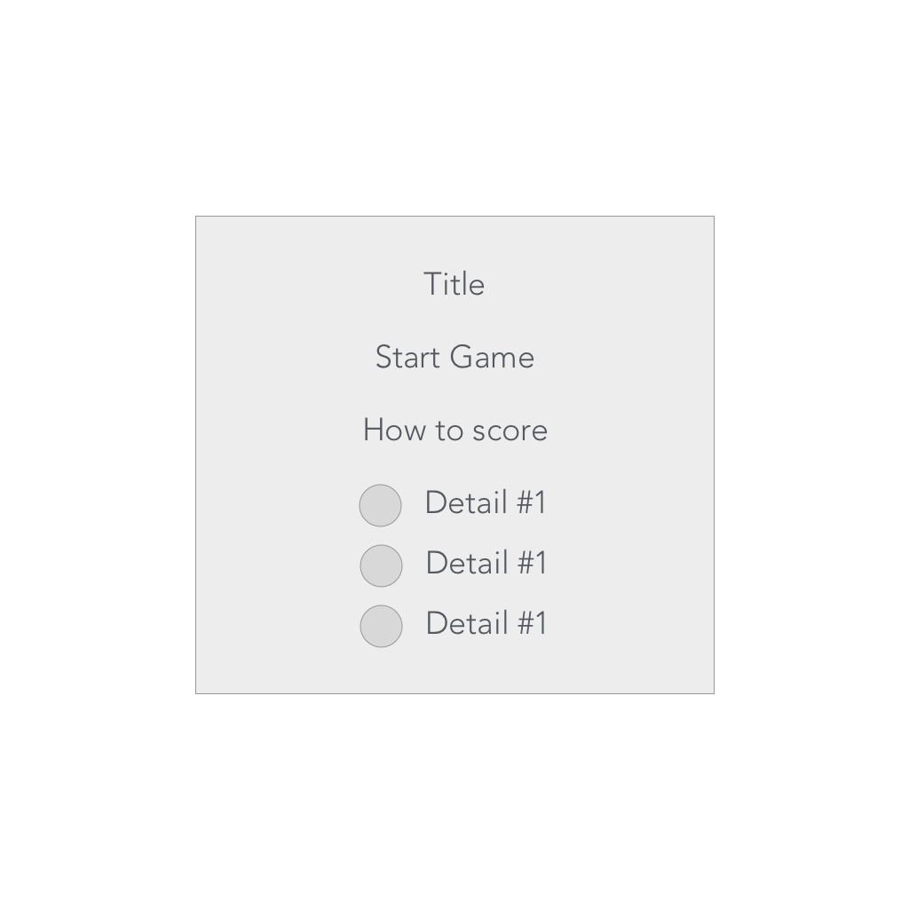
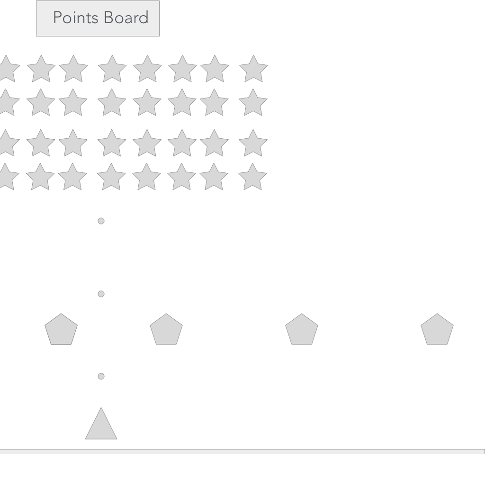
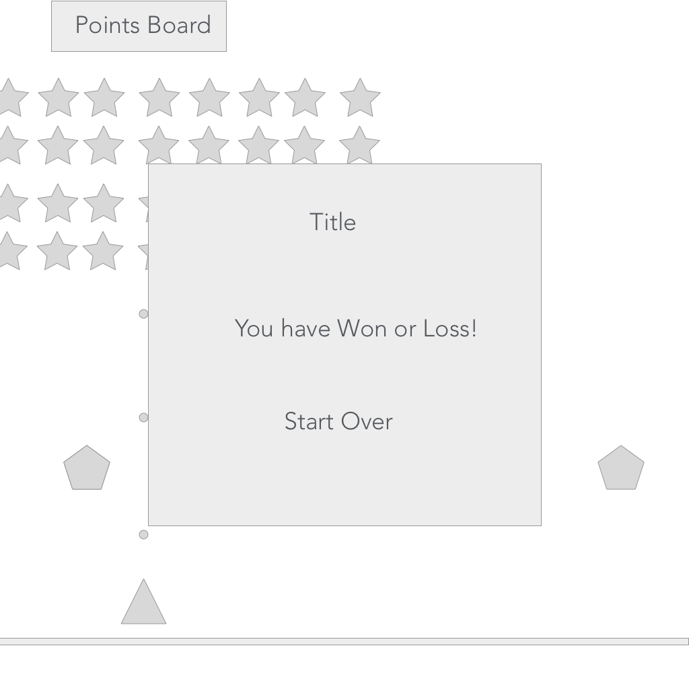

[Link to Trello Board](https://trello.com/b/AjscZfIp/project-1-gameboard)

Here are my sources for game:

https://soundcloud.com/martincohen/sets/arcade-game-music

http://www.html5canvastutorials.com/

https://developer.mozilla.org/en-US/docs/Web/API/Canvas_API/Tutorial

http://keycode.info/

https://developer.mozilla.org/en-US/docs/Web/API/KeyboardEvent/keyCode

http://www.w3schools.com/jsref/event_key_keycode.asp

https://jeremyckahn.github.io/keydrown/

http://codepen.io/olivier-c/pen/qEeNOw
